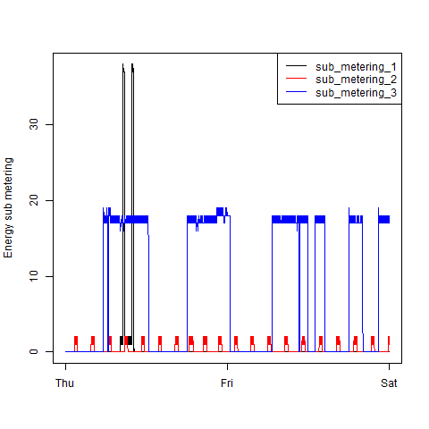
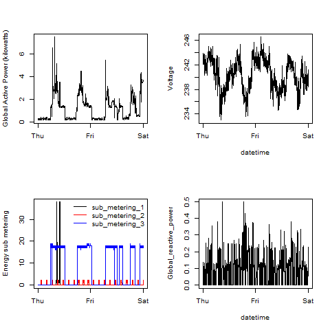

## Introduction

This project uses data from
the <a href="http://archive.ics.uci.edu/ml/">UC Irvine Machine
Learning Repository</a>, a popular repository for machine learning
datasets. In particular, we will be using the "Individual household
electric power consumption Data Set:

* <b>Dataset</b>: <a href="https://d396qusza40orc.cloudfront.net/exdata%2Fdata%2Fhousehold_power_consumption.zip">Electric power consumption</a> [20Mb]

* <b>Description</b>: Measurements of electric power consumption in
one household with a one-minute sampling rate over a period of almost
4 years. Different electrical quantities and some sub-metering values
are available.

The following descriptions of the 9 variables in the dataset are taken
from
the <a href="https://archive.ics.uci.edu/ml/datasets/Individual+household+electric+power+consumption">UCI
web site</a>:

<ol>
<li><b>Date</b>: Date in format dd/mm/yyyy </li>
<li><b>Time</b>: time in format hh:mm:ss </li>
<li><b>Global_active_power</b>: household global minute-averaged active power (in kilowatt) </li>
<li><b>Global_reactive_power</b>: household global minute-averaged reactive power (in kilowatt) </li>
<li><b>Voltage</b>: minute-averaged voltage (in volt) </li>
<li><b>Global_intensity</b>: household global minute-averaged current intensity (in ampere) </li>
<li><b>Sub_metering_1</b>: energy sub-metering No. 1 (in watt-hour of active energy). It corresponds to the kitchen, containing mainly a dishwasher, an oven and a microwave (hot plates are not electric but gas powered). </li>
<li><b>Sub_metering_2</b>: energy sub-metering No. 2 (in watt-hour of active energy). It corresponds to the laundry room, containing a washing-machine, a tumble-drier, a refrigerator and a light. </li>
<li><b>Sub_metering_3</b>: energy sub-metering No. 3 (in watt-hour of active energy). It corresponds to an electric water-heater and an air-conditioner.</li>
</ol>

## Loading the data

When loading the dataset into R, following things must be taken into account:

* The dataset has 2,075,259 rows and 9 columns. First
calculating a rough estimate of how much memory the dataset will require
in memory before reading into R. Making sure the computer has enough
memory (most modern computers should be fine).

* We will only be using data from the dates 2007-02-01 and
2007-02-02. One alternative is to read the data from just those dates
rather than reading in the entire dataset and subsetting to those
dates. Although in this case whole dataset was read and then then subsetted accordingly

* It was useful to convert the `Date` and `Time` variables using `as.Date` and `as.POSIXct` functions

* Note that in this dataset missing values are coded as `?`.

## Making Plots

Our overall goal here is simply to examine how household energy usage
varies over a 2-day period in February, 2007. 

For each plot

* Constructed the plot and saved it to a PNG file with a width of 480
pixels and a height of 480 pixels.

* Named each of the plot files as `plot1.png`, `plot2.png`, `plot3.png` and `plot4.png`.

* Created a separate R code file (`plot1.R`, `plot2.R`, etc.) that
constructs the corresponding plot, i.e. code in `plot1.R` constructs
the `plot1.png` plot. The code files **include code for reading
the data** so that the plot can be fully reproduced. The code that creates the PNG file is also included

* Added the PNG file and R code file to the github repository

The following four plots were constructed

### Plot 1

 

### Plot 2

 

### Plot 3

 

### Plot 4

 

